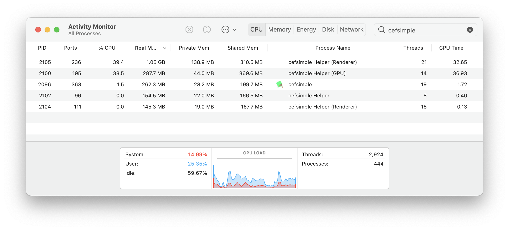

# cef-guide

---

Chromium Embedded Framework (CEF) is a simple framework for embedding Chromium-based browsers in other applications.

## Guide for cefsimple

> MacBook Pro (13-inch, M1, 2020) / macOS Big Sur

Step 1: download the builds from https://cef-builds.spotifycdn.com/index.html

select the MacOS 64-bit Standard binary distribution.

Step 2:

```bash
mkdir build

cd build

cmake ..

# use x86_64
arch -x86_64 make
```

Step 3:

```bash
./tests/cefsimple/Release/cefsimple.app/Contents/MacOS/cefsimple --url=https://www.github.com
```

<p align="center">
  
</p>

<p align="center">
  
</p>

## Links

- [source code](https://bitbucket.org/chromiumembedded/cef/src/master/)
